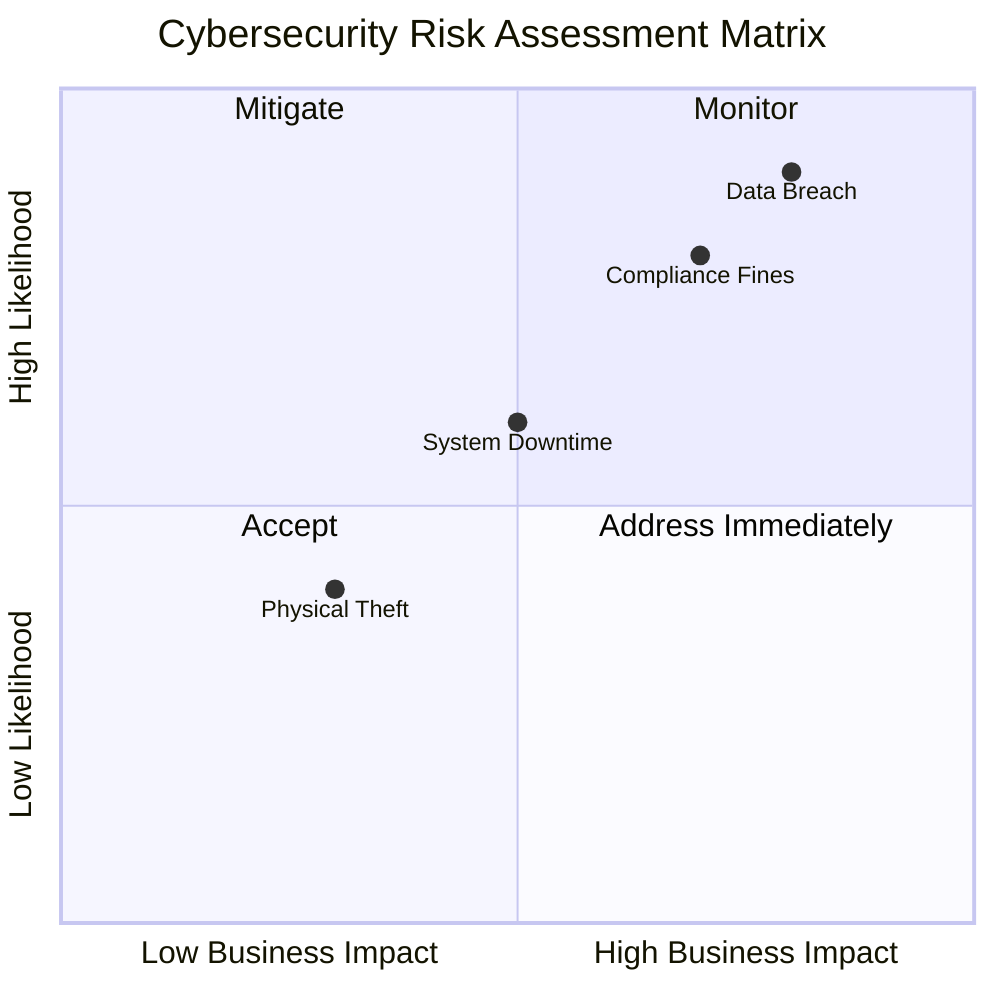
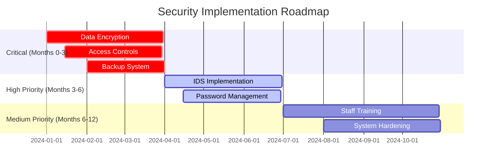
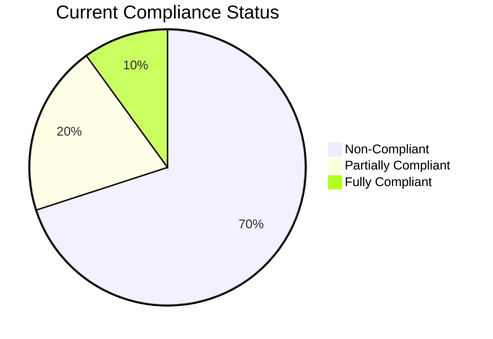

# Office of the State Surveyor General, Lagos State - Internal IT Security Audit

## 📋 Project Overview

Comprehensive internal IT audit conducted for the Office of the State Surveyor General, Lagos State, Nigeria. This critical government office manages sensitive land survey data, geospatial records and citizen information essential for Lagos State's urban development and land administration.

**Audit Period**: Q4 2024  
**Framework**: NITDA Framework & NDPR 2019  
**Scope**: IT infrastructure and data protection assessment  

## 🎯 Key Findings

- **Risk Score**: 8/10 (High)
- **Critical Gaps**: 6 identified
- **NDPR Compliance**: Non-compliant
- **Data Protection**: Land records and citizen PII at risk

## 🛠️ Skills Demonstrated

- Nigerian Public Sector IT Assessment
- NDPR Compliance Evaluation  
- Risk Management for Government Context
- Technical Report Writing

## 📁 Project Structure

## 📊 Visual Overview

### Risk Assessment Matrix

*Risk assessment showing data breach and compliance as top priorities*

### Implementation Timeline

*Three-phase implementation approach*

### Compliance Status

*Current compliance status across regulatory frameworks*